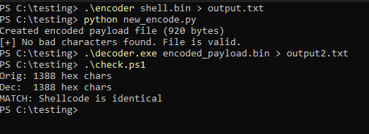

## Shellcode Showcase

This is a short repo of custom shellcode encoding and decoding using C. Shellcode encoding is 
changing original shellcode into a set of arbitrary bytes by following whatever rules you make. 
Obviously, decoding is following the same rules in reverse. I decided to take a brain break from 
bigger projects that I have been working on and find something quick to learn. This is a useful 
skill to learn as it can help with evading EDR and eliminating null bytes. The reason that these 
bytes must be eliminated is because many exploits rely on null terminated string functions such as:
gets(), strcat(), or strcpy(). Functions like these interpret the null byte as the end of the string marker, 
which causes the exploit or whatever you decide to run to end prematurely. to put it simply, the target buffer
receives only part of the payload. I have the encoder and decoder written in C. For the encoder, I saved the output 
to a txt file and then used a basic python script to convert it back to a bin file. Could I have just done this in the encoder? 
Yes, I could have, but i did feel like testing my python since i despise it and rarely ever touch the thing to begin with. 
I also have a PowerShell script to check and make sure that the output from the decoder and the original bin file chars match. 
The images folder will show how exactly I did everything. Now, it is time to go back to more exploits.

